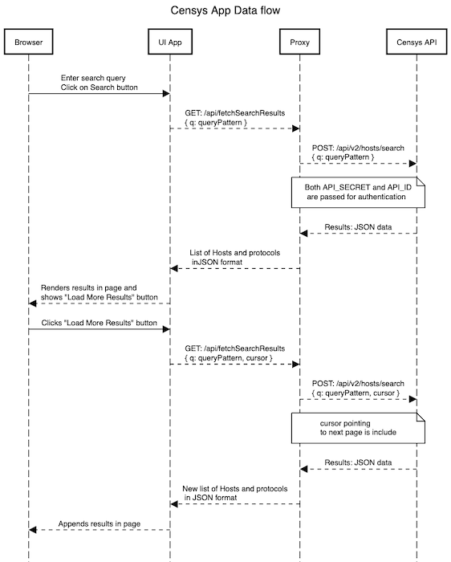

# Censys Search Application

A **React-based** web application designed for searching IPv4 hosts and displaying detailed protocol information as shown in screenshot below. The application supports paginated results for seamless navigation and utilizes the **Censys REST API** for data retrieval. It features a clean and responsive interface styled with Material-UI, a modular component architecture for maintainability and scalability, and modern state management techniques for efficient performance.

To enhance security, the application includes a **Node.js-based secure proxy backend**. This proxy acts as an intermediary between the frontend and the **Censys REST API**, ensuring that sensitive API credentials are stored and accessed securely on the server side. By preventing direct exposure of API keys to the client, the backend mitigates potential risks such as credential theft and unauthorized access. The proxy also validates incoming requests, sanitizes data, and enforces controlled communication with the external API, further strengthening the application’s security posture.


---
---

## Table of Contents

1. [Features](#features)
2. [Quick Start](#quick-start)
3. [Prerequisites](#prerequisites)
4. [Installation](#installation)
5. [Environment Variables](#environment-variables)
6. [Build Instructions](#build-instructions)
7. [Run the Application](#run-the-application)
8. [How to Test](#how-to-test)
9. [Folder Structure](#folder-structure)
10. [Approach and Thought Process](#approach-and-thought-process)
11. [Backend Implementation as a Secure Proxy](#backend-implementation-as-a-secure-proxy)
12. [Frontend Components and Architecture](#frontend-components-and-architecture)
13. [Unit Testing](#unit-testing)
14. [Deployment](#deployment)
15. [Technical Debts](#technical-debts)

---
---

## Features

- **Search for IPv4 Hosts**: Enables users to search for IP addresses and view associated protocol details using the Censys REST API.
- **Clean and Paginated Layout**: Displays results in a user-friendly interface with seamless pagination for large datasets.
- **Secure API Calls**: Implements a Node.js proxy server to securely route requests to the Censys REST API, safeguarding sensitive credentials.
- **Environment Variable Configuration**: Utilizes environment variables to securely manage API credentials and configuration, supporting multiple environments (development, testing, production).
- **Modular Component Architecture**: Features a scalable and reusable component-based design for maintainability and future enhancements.
- **Modern UI with Dynamic Feedback**: Styled with Material-UI to deliver a responsive, accessible, and visually appealing interface, featuring a dynamic loading spinner to provide real-time feedback during API calls.
- **Built with React and TypeScript**: Leverages modern web development technologies for strong typing, maintainability, and efficient performance.

---
---

## Quick Start

This README provides comprehensive details on installation, configuration, starting/testing the **Censys Search application**, and the design and architecture for both the frontend and backend proxy implementations.

For a concise guide to quickly start and manually test the application, please refer to the **[Quick Start](./QUICKSTART.md)** file.

---
---

## Prerequisites

1. Before setting up or running the application, ensure the following requirements are met:
	- `Node.js`: Install version 18.15.x or later. [Download Node](https://nodejs.org/en)
   - `npm`: Must be version 9.x or later (comes bundled with Node.js)

2. Install dependencies:
	- `pkg`: For packaging the application into standalone executables. Install globally with:

      ```bash
      npm install -g pkg
      ```

3. Operating System: Compatible with Linux, MacOS, or Windows
4. Access to **Censys REST API**: 
   - A valid API ID and API Secret for the Censys REST API.

---
---

## Installation

First, validate **prerequisites** above are met before proceeding with installation.

1. **Clone the Repository**
   ```bash
   git clone https://github.com/gparraMstr/censys-assessment.git
   cd censys-assessment
   ```

2. **Install Dependencies**

   - **Frontend**:
     Navigate to the root directory (where the `src` folder resides) and install dependencies:
     ```bash
     npm install
     ```

   - **Backend**:
     Navigate to the `backend` folder and install dependencies:
     ```bash
     cd backend
     npm install
     ```

3. **Set Up Environment Variables**
Environment variables are explained in more details in following section [Environment Variables](#environment-variables). Below, a quick set of instructions are laid out for setting up these variables.

   - **Frontend**:
     Create a `.env` file in the root directory with the following variables:
     ```plaintext
     REACT_APP_CENSYS_PROXY_URL=http://localhost:5001/api/fetchSearchResults # Backend proxy URL
     BUILD_PATH=./backend/build                                              # Build destination folder
     ```

   - **Backend**:
     Create a `.env` file in the `backend` folder with the following variables:
     ```plaintext
     CENSYS_API_ID=your_api_id
     CENSYS_API_SECRET=your_api_secret
     CENSYS_API_URL=https://search.censys.io/api/v2/hosts/search
     ```

---
---

## Environment Variables

To ensure secure and seamless configuration, the application relies on environment variables for both the frontend and backend. These variables allow sensitive information, such as API credentials, to be stored securely and enable customization for different environments (e.g., development, testing, production).

Each environment variable should be defined in the respective `.env`` files for the frontend and backend folders, ensuring proper integration and functionality. 

```
censys-assessment/
├── backend/      # Backend proxy implementation
│   ├── .env      # Backend environment variables file
├── .env          # Frontend environment variables file
```

Below are the required environment variables for each part of the application:

### Backend Environment Variables

The backend requires the following variables to securely interact with the Censys REST API:
- `CENSYS_API_ID`: Your unique API ID for Censys.
- `CENSYS_API_SECRET`: Your secret key for Censys API authentication.
- `CENSYS_API_URL`: The endpoint URL for the Censys Search REST API.

### Frontend Environment Variables

The frontend requires the following variables to configure the build path and communicate with the backend proxy:
- `BUILD_PATH`: Specifies the path for the compiled frontend build folder, typically set to `./backend/build`.
- `REACT_APP_CENSYS_PROXY_URL`: The URL of the backend proxy for secure API requests.


---
---

## Build Instructions

These instructions are meant to compile the frontend application.

1. **Switch back to frontend parent folder** from `backend` folder if not done yet.

2. **Run the Build Command** on frontend folder
   ```bash
   npm run build
   ```

3. **Output Directory**
   By default, the build output is placed in the `backend/build/` directory. The `BUILD_PATH` is specified in `.env`, it will be in the custom directory.
  
   Validate that folder was created and properly populated as follows:

   ```
   censys-assessment/
   ├── backend/         # Backend proxy implementation
   │   ├── build/       # Build folder containing compiled React UI search application
   ```

---
---

## Run the Application

   First, it will be necessary to **build Frontend code** prior to running the application as previously indicated in the [Build Instructions](#build-instructions) section above.

   Now, there are two ways to run the application: stand-alone app and production and development mode.

   1. **Stand-alone app**: As specified in the assessment requirements, this is a self-contained application which will require packaging both Frontend and Backend applications into a stand-alone application to run on Linux, MacOS and Windows. To get the stand-alone app, it is necessary to successfully configure and build the frontend app and this is fully explained in the [Deployment](#deployment) section.


   2. **Production and Development**:
   The application supports both production and development modes, each tailored for specific use cases:

   - Production Mode:
      In this mode, both the Frontend and Backend applications run on the same Node.js service instance on port `5001`. The backend proxy is started to handle API requests securely, while the Frontend application is served as pre-built static files deployed under the build folder. This configuration is ideal for deployment in production environments.

   - Development Mode:
      Designed for development purposes, this mode allows developers to work on the Frontend with real-time code reloading, enabling efficient testing and debugging. In this setup, the backend proxy runs on port `5001` to handle API requests, while the Frontend runs on a separate development server on port `3000`. Both services must run simultaneously for full functionality.

---

### How to Run

#### Production mode (Recommended)
- **Backend**:
   - Start the backend proxy service which also serves the UI app as static content:
      ```bash
      cd backend
      node index.js
      or
      npm run start
      ```

- These commands will start the backend proxy server and the frontend applications on `5001` port.
- Open browser and follow manual testing instructions in [How to Test](#how-to-test) section.


#### Development mode
Below are the instructions on how to start frontend and/or backend applications.

- **Frontend**:
   Start the frontend React application in dev mode and also requires the backend to be running to use proxy:
   ```bash
   npm run build
   npm run start
   ```

- **Backend**:
   Start the backend proxy service which also serves the UI app as static content:
   ```bash
   cd backend
   node index.js
   or
   npm run start
   ```

- As previously indicated, the application will run at `http://localhost:3000`, and the backend proxy server will handle API requests at `http://localhost:5001`.
- Open browser and follow manual testing instructions in [How to Test](#how-to-test) section below.

---
---

## How to Test

1.	Unit Testing:
- Review [Unit Testing](#unit-testing) for more details on how to run unit testing.

2.	Manual Testing:
- Run both frontend and backend proxy apps in either Production or Development as previously described.
- Open a browser and load either `http://localhost:5001` (production) or `http://localhost:3000` (development) 
- Enter a valid query text in **Search textfield** like this: `services.http.response.headers.location=/.*(\.\.\/)+.*(\.asp|\.php|\.js|\.cgi).*/`
- Click on **Search** button
- Wait for data to load
- Scroll down and click **Load More Results** button
- New data should be appended.

---
---

## Folder Structure

```
censys-assessment/
├── public/                               # Static assets
├── src/                                  # Frontend source code
│   ├── components/                       # Reusable React components
│   │   ├── SearchPage/                   # Main search page components
│   │   │   ├── SearchPage.tsx            # Main container for search functionality
│   │   │   ├── SearchBar.tsx             # Search input and submit button
│   │   │   ├── ResultList.tsx            # List to display hosts results
│   │   │   ├── ResultItem.tsx            # Component for individual host result
│   │   │   ├── ResultItemProtocol.tsx    # Component for host's protocol results
│   │   │   ├── LoadingSpinner.tsx        # Loading indicator
│   │   │   ├── PaginationButton.tsx      # Button for loading more results
│   │   └── types/                        # TypeScript type definitions
│   ├── reducers/                         # Reducer functions for state management
│   │   ├── searchReducer.ts              # Reducer for search-related state
│   ├── services/                         # API service functions for frontend
│   │   ├── searchService.ts              # Handles API requests to the backend proxy
│   ├── utils/                            # Utility functions
│   │   ├── formatUtils.ts                # Functions for formatting
│   ├── App.tsx                           # Root component
│   ├── index.tsx                         # Entry point for the application
│   ├── App.css                           # Global styles
├── backend/                              # Backend proxy implementation
│   ├── build                             # Folder containing compiled Frontend application
│   ├── index.js                          # Main server file for the Node.js proxy
│   ├── package.json                      # Backend dependencies and scripts
│   ├── .env                              # Backend environment variables
│   └── README.md                         # Documentation for the backend
├── .env                                  # Frontend environment variables
├── package.json                          # Frontend dependencies and scripts
```

---
---

## Approach and Thought Process

The development of this application was guided by the following principles and considerations:

1.	**Security First**:
      - A `Node.js` backend proxy was implemented to safeguard sensitive API credentials (e.g., API ID and secret). This design ensures secure communication between the UI and the **Censys REST API**, preventing direct exposure of credentials in the client-side application.

2.	**Modularity and Maintainability**:
      - The frontend is built with a **component-based architecture**, making the application modular and easier to maintain.
      - Components such as `SearchBar`, `ResultList`, and `PaginationButton` were designed to encapsulate specific responsibilities, ensuring reusability and separation of concerns.

3.	**Scalability**:
      - State management uses a reducer pattern (`searchReducer`) to provide centralized and predictable state transitions. This approach ensures that the application can scale easily if new features or additional complexity are introduced.
      - Design choices like lazy loading for pagination and a responsive UI with **Material-UI** prioritize scalability and performance.

4.	**Testing and Quality Assurance**:
      - Unit tests cover critical components and utility functions to validate functionality and prevent regressions.
      - Testing strategies were documented, including steps for running automated and manual tests.

5.	**User Experience**:
    - A simple and intuitive user interface was designed to reflect a minimalistic version of Censys.io’s IPv4 search page. Features like a loading spinner and paginated results improve the overall user experience.

6.	**Time Constraints and Future Enhancements**:
      - Due to the time constraints of this assessment, certain features and improvements were noted for future consideration, such as:
      - End-to-end testing automation using tools like `WebdriverIO`.
      - Implementing sorting and page size options in the UI.
      - Enhancing error handling to provide more detailed and user-friendly messages.
      - Optimizing performance for handling large datasets.
      - More details in [Technical Debts](#technical-debts) section.

This approach balances delivering a functional and secure application while laying the groundwork for future scalability, usability, and quality improvements.

---
---

## Backend Implementation as a Secure Proxy

The backend serves as a secure proxy (`Node.js`) between the frontend application and the Censys REST API. This design is implemented to enhance security by handling sensitive API credentials on the server side and ensuring they are never exposed to the client.

---

### Key Features of the Backend Proxy Implementation

1. **Hides API Credentials**:
   - The backend uses environment variables (`CENSYS_API_URL`, `CENSYS_API_ID` and `CENSYS_API_SECRET`) to securely store sensitive API credentials.
   - These credentials are never sent to or accessible from the frontend, preventing potential misuse by malicious actors.

2. **Centralized API Communication**:
   - All communication with the Censys REST API is routed through the backend.
   - This ensures that API requests and responses are sanitized and controlled by the backend, reducing the risk of direct manipulation.

3. **Request Validation**:
   - The backend can validate incoming requests from the frontend, ensuring only authorized and properly formatted requests are forwarded to the API.

4. **Response Handling**:
   - The backend processes responses from the Censys REST API, handling any errors or sanitizing data before sending it to the client.
   - This protects the frontend from handling potentially sensitive error details.

5. **CORS and Rate Limiting**:
   - The backend can enforce Cross-Origin Resource Sharing (CORS) policies to restrict which origins can access the API proxy.
   - Additional security layers, such as rate limiting, can be added to prevent abuse.

6. **Unified Port for Client and Proxy**:
   - In production mode, the backend serves both the proxy and the frontend UI, reducing the number of exposed ports and simplifying deployment.

---

### How It Works

#### **Environment Variables**:
   - The credentials for the Censys REST API are stored securely in a `.env` file within the backend directory:
     ```plaintext
     CENSYS_API_ID=your_api_id
     CENSYS_API_SECRET=your_api_secret
     CENSYS_API_URL=censys_api_url
     ```

#### **Proxy Route**:
   - The backend defines an endpoint (e.g., `GET /api/fetchSearchResults`) that the frontend uses to send requests as sample code below shows (**actual implementation differs from this**):

     ```javascript
     app.get('/api/fetchSearchResults', async (req, res) => {
         const { query, pageToken } = req.body;
         try {
             const response = await fetch('https://search.censys.io/api/v2/hosts/search', {
                 method: 'POST',
                 headers: {
                     'Authorization': `Basic ${Buffer.from(`${process.env.CENSYS_API_ID}:${process.env.CENSYS_API_SECRET}`).toString('base64')}`,
                     'Content-Type': 'application/json',
                 },
                 body: JSON.stringify({ query, pageToken }),
             });
             const data = await response.json();
             res.json(data);
         } catch (error) {
             res.status(500).json({ error: error.message });
         }
     });
     ```

#### **Frontend Communication**:
Sequence flow below depicts how communication takes place:



1.	User Interaction: The browser sends a search query via the UI App, initiating a `GET` request to backend proxy (`http://localhost:5001/api/fetchSearchResults`).
2.	Secure Proxy Communication: The UI App forwards the request to the Proxy, which securely translates it into a `POST` request to the Censys REST API (`https://search.censys.io/api/v2/hosts/search`), including API_SECRET and API_ID for authentication.
3.	Data Retrieval: The Censys API responds with a JSON payload containing a list of hosts, protocols, and a cursor for pagination, which the Proxy relays back to the UI App.
4.	Results Display: The UI App renders the results in the browser and displays a “Load More Results” button if additional pages are available.
5.	Pagination Workflow: On clicking “Load More Results,” the UI App fetches the next page using the cursor, appends new results to the existing list, and repeats the process until all results are loaded.

---

This implementation enhances the overall security of the application by isolating sensitive operations on the server side while maintaining a clean and responsive frontend experience.

---
---

## Frontend Components and Architecture

The frontend of the application is built using React and TypeScript, leveraging a modular component-based architecture to ensure scalability, maintainability, and reusability. Below is an explanation of each key component and the overall structure.

---

### Component-based tree structure

```
Censys Search Application
├── App (Root Component)
│   ├── Header
│   │   ├── Title
│   │   ├── Subtitle
│   └── MainContent
│       ├── SearchPage (Main Container)
│       │   ├── SearchBar
│       │   │   ├── InputField
│       │   │   ├── SubmitButton
│       │   ├── ResultList
│       │   │   ├── ResultItem (Individual Result)
│       │   │   │   ├── ResultItemProtocol (Protocol Chip)
│       │   ├── PaginationButton
│       │   ├── LoadingSpinner
│       │   ├── ErrorMessage
│   └── Footer
│       ├── CopyrightNotice
│       ├── ExternalLinks
```
---

#### Details for Each Component

1.	App: The root component that manages the overall layout of the application.
   - Header: Contains the application’s title and subtitle.
      - Title: Displays the name of the application.
      - Subtitle: Provides a brief description or purpose of the app.
   - MainContent: Wraps the core functionality provided by SearchPage.
2.	SearchPage: The central component handling search, results, and pagination.
   - SearchBar: Manages user input and search query submission.
      - InputField: Text input for users to enter search queries.
      - SubmitButton: Button to initiate the search.
   - ResultList: Displays the search results.
      - ResultItem: Represents an individual search result.
         - ResultItemProtocol: Displays protocol details (e.g., HTTP, HTTPS) for the result as a styled chip.
   - PaginationButton: Allows users to load additional results.
   - LoadingSpinner: Indicates when data is being fetched from the backend.
   - ErrorMessage: Displays error messages if API calls fail.
3.	Footer: The footer of the application.
   - CopyrightNotice: Displays copyright information.
   - ExternalLinks: Links to external resources, such as documentation or API references.

---

### Key Components

#### **1. SearchPage**
- **Location**: `src/components/SearchPage/SearchPage.tsx`
- **Description**: This is the main container for the search functionality. It manages the state for the search process, including query input, results, loading state, and pagination.
- **Responsibilities**:
  - Coordinates interactions between child components (e.g., `SearchBar`, `ResultList`).
  - Manages the application's primary state (e.g., results, loading state, pagination tokens).
  - Sends requests to the backend proxy and handles responses.

#### **2. SearchBar**
- **Location**: `src/components/SearchPage/SearchBar.tsx`
- **Description**: A controlled input field for users to enter search queries.
- **Responsibilities**:
  - Captures user input.
  - Triggers the `onSearch` callback when the search form is submitted.
  - Displays a loading indicator while requests are in progress.

#### **3. ResultList**
- **Location**: `src/components/SearchPage/ResultList.tsx`
- **Description**: Renders a list of search results.
- **Responsibilities**:
  - Iterates over the `results` array and renders each result using the `ResultItem` component.
  - Handles scenarios where no results are available.

#### **4. ResultItem**
- **Location**: `src/components/SearchPage/ResultItem.tsx`
- **Description**: Displays individual search result details, such as the IP address and associated protocols.
- **Responsibilities**:
  - Formats and displays information for a single search result.
  - Handles protocol visualization using the `ResultItemProtocol` component.

#### **5. LoadingSpinner**
- **Location**: `src/components/SearchPage/LoadingSpinner.tsx`
- **Description**: Displays a spinner when the application is loading.
- **Responsibilities**:
  - Provides feedback to the user during API calls.

#### **6. PaginationButton**
- **Location**: `src/components/SearchPage/PaginationButton.tsx`
- **Description**: A button to load the next page of results.
- **Responsibilities**:
  - Triggers the `onLoadMore` callback when clicked.
  - Handles the disabled state when no more results are available or a request is in progress.

#### **7. State Management**
- **Reducer**: `src/reducers/searchReducer.ts`
  - Manages the application state (e.g., results, query, loading state, pagination tokens) using a reducer-based approach.
- **Hooks**: Custom hooks like `useSearchService` abstract the logic for interacting with the backend API and provide a clean interface for components.

---

### Architecture

#### **Component-Based Design**
- **Modular Components**:
  - The application is divided into reusable components to promote separation of concerns and improve maintainability.
- **State Management**:
  - Centralized state management is achieved using a reducer pattern (`searchReducer`), ensuring predictable state transitions.

#### **Data Flow**
1. **Frontend Interaction**:
   - Users interact with the UI through the `SearchBar` and `PaginationButton` components.
2. **API Requests**:
   - `GET` requests are sent to the backend proxy via the `searchService`.
3. **State Updates**:
   - Responses are processed and the state is updated using the reducer.
4. **Rendering**:
   - Updated state triggers a re-render of the `ResultList` and associated components.

---

This architecture ensures the application remains scalable and maintainable while providing a clean and responsive user experience.

---
---

## Unit Testing

Make sure **frontend app** has been built before running any test.

This application employs **Jest** and **React Testing Library** for unit testing. These tools provide a robust and efficient way to validate the behavior of components, utilities, and application logic.

---

### Testing Setup

Unit tests are located within the frontend's `src` directory. Each test file follows the convention `ComponentName.test.tsx` or `utilName.test.ts`.

---

### Run Tests

To execute the unit tests:

   ```bash
   npm run test
   or
   npm test
   ```

This command runs all test files and provides a summary of the results, including passed and failed tests.

---

### Folder Structure for Tests

```
src/
├── components/
│   ├── SearchPage/
│   │   ├── SearchBar.test.tsx        # Tests for SearchBar component
│   │   ├── ResultList.test.tsx       # Tests for ResultList component
│   │   ├── ResultItem.test.tsx       # Tests for ResultItem component
│   │   ├── ResultItemProtocol.test.tsx  # Tests for ResultItemProtocol component
│   │   ├── LoadingSpinner.test.tsx   # Tests for LoadingSpinner component
│   │   ├── PaginationButton.test.tsx # Tests for PaginationButton component
│   │   ├── SearchPage.test.tsx       # Tests for SearchPage component
├── reducers/
│   ├── searchReducer.test.ts         # Tests for searchReducer logic
├── utils/
│   ├── formatUtils.test.ts           # Tests for utility functions
```

---

### Testing Libraries

1.	Jest:
   - A JavaScript testing framework that provides a simple API for testing.
   - Automatically identifies test files with .test.tsx or .test.ts extensions.
   - Features snapshot testing for ensuring UI consistency.
2.	React Testing Library:
   - A lightweight testing library focused on testing React components.
   - Encourages best practices by testing components in a manner similar to how users interact with the UI.


---

### Key Test Cases

#### Components

- SearchBar:
   - Validates user input handling.
   - Ensures onSearch is triggered on form submission.
   - Confirms the correct behavior of the loading state.
- ResultList:
   - Ensures all results are rendered correctly.
   - Tests scenarios with empty results.
- ResultItem:
   - Validates the correct rendering of individual result items, including IP and protocols.
- PaginationButton:
   - Ensures the button is disabled when there are no more results or during loading.
   - Verifies onLoadMore is triggered on click.

#### Reducer

- searchReducer:
   - Tests state updates for all action types (SET_LOADING, SET_RESULTS, APPEND_RESULTS, SET_QUERY).
   - Validates default state and error handling for unknown actions.

#### Utilities

- formatUtils:
   - Tests formatting functions for accuracy, such as protocol count and string manipulations.

---

### Writing New Tests

To add a new test:

1.	Create a .test.tsx file alongside the component or utility to be tested.
2.	Import the necessary libraries:
```typescript
import { render, screen } from '@testing-library/react';
import SearchBar from './SearchBar';
```
3.	Write test cases using describe and it blocks:
```typescript
   describe('SearchBar Component', () => {
      it('renders the input field correctly', () => {
         render(<SearchBar onSearch={jest.fn()} isLoading={false} />);
         const input = screen.getByRole('textbox');
         expect(input).toBeInTheDocument();
      });
   });
```
4.	Run the test:
```bash
npm run test
   ```
---

### Debugging Tests

- Use the `--watch` flag to run tests interactively:
```bash
npm test -- --watch
```

- Use the `--coverage` flag to generate a test coverage report:
```bash
npm test -- --coverage
```

The coverage report provides insights into which parts of the codebase are not tested.

---
---

## Deployment

This application provides flexible deployment options to cater to different stages of the development lifecycle and production use cases. Whether running locally for testing or packaging as a standalone executable (assessment requirement), the deployment process ensures the integration of both frontend and backend components.

---

### Available Deployment Methods

1. **Local Deployment for Testing and Development**:  
   This mode is suitable for local testing or active development. The backend proxy runs as a `Node.js` application, and the frontend is built and served as static files through the same instance.

   **Steps**:
   - Build the frontend using `npm run build`.
   - Start the backend proxy and serve the frontend by running `node index.js` or `npm run start` from the `backend` directory.
   - Access the application locally at `http://localhost:5001`.

2. **Standalone Application for Distribution**:  
   This method packages the application (frontend and backend) into a single **executable** for easy distribution. The standalone version eliminates dependencies on external runtime environments like Node.js, making it ideal for deploying on various operating systems (Linux, MacOS, Windows).  

   **Steps**:
   - Build the frontend if not already built using `npm run build`.
   - Package the application using `pkg .` from the `backend` directory.
   - Run the generated executable to launch the application on port `5001`.

3. **Production-Ready Deployment**:  
   In a production environment, the application can be deployed as a consolidated `Node.js` service. The backend proxy securely handles API calls, and the frontend is served as pre-built static files.  

   **Steps**:
   - Build the frontend project using `npm run build`.
   - Deploy the contents of the `backend` folder, ensuring `index.js` serves both the proxy and the static frontend files.
   - Configure a process manager (e.g., PM2) or containerize the application for enhanced reliability.

---

### To Deploy and Run Locally

1. Build the frontend project:
   ```bash
   npm run build
   ```
   Ensure `backend/build` is updated.

2. Start the proxy and frontend as a combined Node.js application:
   ```bash
   cd backend
   node index.js
   or
   npm run start
   ```

3. Open your browser and navigate to:
   ```plaintext
   http://localhost:5001
   ```

---

### To Create and Package a Standalone Application

1. Build the frontend project (if not already built):
   ```bash
   npm run build
   ```
   Confirm `backend/build` is up-to-date.

2. Package the application for distribution:
   ```bash
   cd backend
   pkg .
   ```

3. The following files will be generated in the `backend` directory:
   ```
   censys-assessment/
   ├── backend/                # Backend proxy implementation
   │   ├── backend-linux/      # Standalone application for Linux
   │   ├── backend-macos/      # Standalone application for MacOS
   │   ├── backend-windows/    # Standalone application for Windows
   ```

4. Run the appropriate executable for your operating system. For example:
   ```bash
   cd backend
   ./backend-macos
   ```

5. Open your browser and navigate to:
   ```plaintext
   http://localhost:5001
   ```


---
---

## Technical Debts

1. **End-to-End Testing**: 
To ensure the reliability of the application, end-to-end testing automation should be implemented. Using a framework like WebdriverIO is recommended for scripting and executing automated test scenarios that simulate real user interactions.

2. **Sorting and Page Size**: 
The UI functionality can be enhanced by incorporating options for sorting results and adjusting the page size (pagination). This will improve user experience by allowing customized data views based on user preferences.

3. **Comprehensive Unit Testing**: 
Expand the unit test coverage by adding more test cases and suites to validate a broader range of functionality. This will ensure higher code quality, reduce potential bugs, and improve maintainability.

4.	**Error Handling Improvements**:
Enhance error handling mechanisms throughout the application to provide more detailed and user-friendly error messages. This includes logging errors effectively on the backend and showing contextual messages on the frontend.

5.	**Performance Optimization**:
Analyze and optimize performance, particularly for handling large datasets. Techniques such as lazy loading for pagination, optimizing API calls, and minimizing re-renders in React components can be implemented.

6.	**Accessibility Enhancements**:
Ensure the application adheres to accessibility standards (e.g., WCAG 2.1). This includes adding ARIA labels, keyboard navigation support, and color contrast improvements.

7.	**State Management Scalability**:
Evaluate the current state management approach (e.g., reducer) for scalability. If the application grows, consider migrating to a more robust solution like Redux or Zustand.

8.	**Backend Security Enhancements**:
Strengthen the backend proxy by adding:
   - Input validation for incoming requests.
	- Rate limiting to prevent abuse.
	- IP whitelisting or token-based authentication for enhanced security.

9.	**Logging and Monitoring**:
Add comprehensive logging and monitoring solutions for both the frontend and backend. This includes capturing API request/response times, user actions, and system errors.

10. **Configuration Management**:
Implement a more robust configuration management strategy for handling environment variables securely across different environments (development, staging, production).

11. **Internationalization**:
Add functionality to translate descriptors to other languages.

---
---


## Contributing

1. Fork the repository.
2. Create a feature branch: `git checkout -b feature-name`
3. Commit your changes: `git commit -m "Add feature"`
4. Push to the branch: `git push origin feature-name`
5. Open a pull request.

---
---

## License

This project is licensed under the [MIT License](LICENSE).

---
---

## Contact

For questions or issues, please reach out to Gregorio Parra (parra73@gmail.com) or create an issue on the repository.
