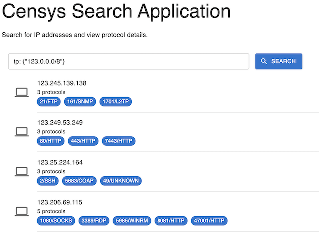

# Censys Search Application

A **React-based** web application designed for searching IPv4 hosts and displaying detailed protocol information. The application supports paginated results for seamless navigation and utilizes the **Censys REST API** for data retrieval. It features a clean and responsive interface styled with Material-UI, a modular component architecture for maintainability and scalability, and modern state management techniques for efficient performance.

To enhance security, the application includes a **Node.js-based secure proxy backend**. This proxy acts as an intermediary between the frontend and the Censys REST API, ensuring that sensitive API credentials are stored and accessed securely on the server side. By preventing direct exposure of API keys to the client, the backend mitigates potential risks such as credential theft and unauthorized access. The proxy also validates incoming requests, sanitizes data, and enforces controlled communication with the external API, further strengthening the application’s security posture.



---

## Table of Contents

1. [Features](#features)
2. [Installation](#installation)
3. [Run the Application](#run-the-application)
4. [Folder Structure](#folder-structure)
5. [Backend Implementation as a Secure Proxy](#backend-implementation-as-a-secure-proxy)
6. [Frontend Components and Architecture](#frontend-components-and-architecture)
7. [Frontend Build Instructions](#frontend-build-instructions)
8. [Frontend Testing](#frontend-testing)
9. [Deployment](#deployment)
10. [Environment Variables](#environment-variables)

---

## Features

- **Search for IPv4 Hosts**: Enables users to search for IP addresses and view associated protocol details using the Censys REST API.
- **Clean and Paginated Layout**: Displays results in a user-friendly interface with seamless pagination for large datasets.
- **Secure API Calls**: Implements a Node.js proxy server to securely route requests to the Censys REST API, safeguarding sensitive credentials.
- **Environment Variable Configuration**: Utilizes environment variables to securely manage API credentials and configuration, supporting multiple environments (development, testing, production).
- **Modular Component Architecture**: Features a scalable and reusable component-based design for maintainability and future enhancements.
- **Modern UI with Dynamic Feedback**: Styled with Material-UI to deliver a responsive, accessible, and visually appealing interface, featuring a dynamic loading spinner to provide real-time feedback during API calls.
- **Built with React and TypeScript**: Leverages modern web development technologies for strong typing, maintainability, and efficient performance.

---


## Installation

1. **Clone the Repository**
   ```bash
   git clone https://github.com/gparraMstr/censys-assessment.git
   cd censys-assessment
   ```

2. **Install Dependencies**

   - **Frontend**:
     Navigate to the root directory (where the `src` folder resides) and install dependencies:
     ```bash
     npm install
     ```

   - **Backend**:
     Navigate to the `backend` folder and install dependencies:
     ```bash
     cd backend
     npm install
     ```

3. **Set Up Environment Variables**

   - **Frontend**:
     Create a `.env` file in the root directory with the following variables:
     ```plaintext
     REACT_APP_CENSYS_PROXY_URL='http://localhost:5001/api/fetchSearchResults' # Backend proxy URL
     BUILD_PATH=./backend/build                                              # Build destination folder
     ```

   - **Backend**:
     Create a `.env` file in the `backend` folder with the following variables:
     ```plaintext
     CENSYS_API_ID=your_api_id
     CENSYS_API_SECRET=your_api_secret
     CENSYS_API_URL=https://search.censys.io/api/v2/hosts/search
     ```

---

## Run the Application

   First, it will be necessary to **build Frontend code** prior to running the application as indicated in the [Frontend Build Instructions](#build-instructions).

   Now, there are three ways to run the application: production mode and development mode.

   1. **Stand-alone app**: As specified in the assessment requirements, this is a self-contained application which will require packaging both Frontend and Backend applications into a stand-alone application to run on Linux, MacOS and Windows. This is fully explained in the [Deployment](#deployment) section.


   2. **Production**: Runs both Frontend and Backend application on same node.js service instance on port `5001`. The backend proxy is started to handle API requests, and the Frontend application is served as a static build in this mode. The frontend application is built into compiled content and deployed to backend deployment under the `build` folder as static content.
 
   3. **Development**: Designed for development purposes, this mode allows developers to continue working on frontend application development with real-time code reloading. In this mode, both the frontend and backend must be run simultaneously: the backend proxy runs on port `5001`, while the frontend runs on port `3000`. This setup facilitates efficient development and testing.

   Below are the instructions on how to start frontend and/or backend applications.

   - **Backend**:
     Start the backend proxy service which also serves the UI app as static content:
     ```bash
     cd backend
     node index.js
     or
     npm run start
     ```

   - **Frontend**:
     Start the frontend React application in dev mode and also requires the backend to be running to use proxy:
     ```bash
     npm run start
     ```

   As previously indicated, the application will run at `http://localhost:3000`, and the backend proxy server will handle API requests at `http://localhost:5001`.

---

## Folder Structure

```
censys-assessment/
├── public/                     # Static assets
├── src/                        # Frontend source code
│   ├── components/             # Reusable React components
│   │   ├── SearchPage/         # Main search page components
│   │   │   ├── SearchPage.tsx  # Main container for search functionality
│   │   │   ├── SearchBar.tsx   # Search input and submit button
│   │   │   ├── ResultList.tsx  # List to display hosts results
│   │   │   ├── ResultItem.tsx  # Component for individual host result
│   │   │   ├── ResultItemProtocol.tsx  # Component for host's protocol results
│   │   │   ├── LoadingSpinner.tsx # Loading indicator
│   │   │   ├── PaginationButton.tsx # Button for loading more results
│   │   └── types/              # TypeScript type definitions
│   ├── reducers/               # Reducer functions for state management
│   │   ├── searchReducer.ts    # Reducer for search-related state
│   ├── services/               # API service functions for frontend
│   │   ├── searchService.ts    # Handles API requests to the backend proxy
│   ├── utils/                  # Utility functions
│   │   ├── formatUtils.ts      # Functions for formatting
│   ├── App.tsx                 # Root component
│   ├── index.tsx               # Entry point for the application
│   ├── App.css                 # Global styles
├── backend/                    # Backend proxy implementation
│   ├── build                   # Folder containing compiled Frontend application
│   ├── index.js                # Main server file for the Node.js proxy
│   ├── package.json            # Backend dependencies and scripts
│   ├── .env                    # Backend environment variables
│   └── README.md               # Documentation for the backend
├── .env                        # Frontend environment variables
├── package.json                # Frontend dependencies and scripts
```

---


## Backend Implementation as a Secure Proxy

The backend serves as a secure proxy (`Node.js`) between the frontend application and the Censys REST API. This design is implemented to enhance security by handling sensitive API credentials on the server side and ensuring they are never exposed to the client.

---

### Key Features of the Backend Proxy Implementation

1. **Hides API Credentials**:
   - The backend uses environment variables (`CENSYS_API_URL`, `CENSYS_API_ID` and `CENSYS_API_SECRET`) to securely store sensitive API credentials.
   - These credentials are never sent to or accessible from the frontend, preventing potential misuse by malicious actors.

2. **Centralized API Communication**:
   - All communication with the Censys REST API is routed through the backend.
   - This ensures that API requests and responses are sanitized and controlled by the backend, reducing the risk of direct manipulation.

3. **Request Validation**:
   - The backend can validate incoming requests from the frontend, ensuring only authorized and properly formatted requests are forwarded to the API.

4. **Response Handling**:
   - The backend processes responses from the Censys REST API, handling any errors or sanitizing data before sending it to the client.
   - This protects the frontend from handling potentially sensitive error details.

5. **CORS and Rate Limiting**:
   - The backend can enforce Cross-Origin Resource Sharing (CORS) policies to restrict which origins can access the API proxy.
   - Additional security layers, such as rate limiting, can be added to prevent abuse.

6. **Unified Port for Client and Proxy**:
   - In production mode, the backend serves both the proxy and the frontend UI, reducing the number of exposed ports and simplifying deployment.

---

### How It Works

#### **Environment Variables**:
   - The credentials for the Censys REST API are stored securely in a `.env` file within the backend directory:
     ```plaintext
     CENSYS_API_ID=your_api_id
     CENSYS_API_SECRET=your_api_secret
     CENSYS_API_URL=censys_api_url
     ```

#### **Proxy Route**:
   - The backend defines an endpoint (e.g., `/api/fetchSearchResults`) that the frontend uses to send requests as sample code below shows (**actual implementation differs from this**):

     ```javascript
     app.get('/api/fetchSearchResults', async (req, res) => {
         const { query, pageToken } = req.body;
         try {
             const response = await fetch('https://search.censys.io/api/v2/hosts/search', {
                 method: 'POST',
                 headers: {
                     'Authorization': `Basic ${Buffer.from(`${process.env.CENSYS_API_ID}:${process.env.CENSYS_API_SECRET}`).toString('base64')}`,
                     'Content-Type': 'application/json',
                 },
                 body: JSON.stringify({ query, pageToken }),
             });
             const data = await response.json();
             res.json(data);
         } catch (error) {
             res.status(500).json({ error: error.message });
         }
     });
     ```

#### **Frontend Communication**:
   - The frontend sends requests to the backend proxy (`http://localhost:5001/api/fetchSearchResults`), which forwards them to the Censys REST API.
   - The backend then processes the response and sends it back to the frontend.

---

This implementation enhances the overall security of the application by isolating sensitive operations on the server side while maintaining a clean and responsive frontend experience.


---

## Frontend Components and Architecture

The frontend of the application is built using React and TypeScript, leveraging a modular component-based architecture to ensure scalability, maintainability, and reusability. Below is an explanation of each key component and the overall structure.

---

### Key Components

### **1. SearchPage**
- **Location**: `src/components/SearchPage/SearchPage.tsx`
- **Description**: This is the main container for the search functionality. It manages the state for the search process, including query input, results, loading state, and pagination.
- **Responsibilities**:
  - Coordinates interactions between child components (e.g., `SearchBar`, `ResultList`).
  - Manages the application's primary state (e.g., results, loading state, pagination tokens).
  - Sends requests to the backend proxy and handles responses.

---

#### **2. SearchBar**
- **Location**: `src/components/SearchPage/SearchBar.tsx`
- **Description**: A controlled input field for users to enter search queries.
- **Responsibilities**:
  - Captures user input.
  - Triggers the `onSearch` callback when the search form is submitted.
  - Displays a loading indicator while requests are in progress.

---

#### **3. ResultList**
- **Location**: `src/components/SearchPage/ResultList.tsx`
- **Description**: Renders a list of search results.
- **Responsibilities**:
  - Iterates over the `results` array and renders each result using the `ResultItem` component.
  - Handles scenarios where no results are available.

---

#### **4. ResultItem**
- **Location**: `src/components/SearchPage/ResultItem.tsx`
- **Description**: Displays individual search result details, such as the IP address and associated protocols.
- **Responsibilities**:
  - Formats and displays information for a single search result.
  - Handles protocol visualization using the `ResultItemProtocol` component.

---

#### **5. LoadingSpinner**
- **Location**: `src/components/SearchPage/LoadingSpinner.tsx`
- **Description**: Displays a spinner when the application is loading.
- **Responsibilities**:
  - Provides feedback to the user during API calls.

---

#### **6. PaginationButton**
- **Location**: `src/components/SearchPage/PaginationButton.tsx`
- **Description**: A button to load the next page of results.
- **Responsibilities**:
  - Triggers the `onLoadMore` callback when clicked.
  - Handles the disabled state when no more results are available or a request is in progress.

---

#### **7. State Management**
- **Reducer**: `src/reducers/searchReducer.ts`
  - Manages the application state (e.g., results, query, loading state, pagination tokens) using a reducer-based approach.
- **Hooks**: Custom hooks like `useSearchService` abstract the logic for interacting with the backend API and provide a clean interface for components.

---

### Architecture

#### **Component-Based Design**
- **Modular Components**:
  - The application is divided into reusable components to promote separation of concerns and improve maintainability.
- **State Management**:
  - Centralized state management is achieved using a reducer pattern (`searchReducer`), ensuring predictable state transitions.

#### **Data Flow**
1. **Frontend Interaction**:
   - Users interact with the UI through the `SearchBar` and `PaginationButton` components.
2. **API Requests**:
   - Requests are sent to the backend proxy via the `searchService`.
3. **State Updates**:
   - Responses are processed and the state is updated using the reducer.
4. **Rendering**:
   - Updated state triggers a re-render of the `ResultList` and associated components.

---

This architecture ensures the application remains scalable and maintainable while providing a clean and responsive user experience.

---

## Frontend Build Instructions

1. **Run the Build Command**
   ```bash
   npm run build
   ```

2. **Output Directory**
   By default, the build output is placed in the `backend/build/` directory. The `BUILD_PATH` is specified in `.env`, it will be in the custom directory.
  
   Validate that folder was created and properly populated as follows:

   ```
   censys-assessment/
   ├── backend/         # Backend proxy implementation
   │   ├── build/       # Build folder containing compiled React UI search application
   ```

---

## Frontend Testing

Make sure **frontend app** has been built before running any test.

This application employs **Jest** and **React Testing Library** for unit testing. These tools provide a robust and efficient way to validate the behavior of components, utilities, and application logic.

---

### Testing Setup

Unit tests are located within the frontend's `src` directory. Each test file follows the convention `ComponentName.test.tsx` or `utilName.test.ts`.

---

### Run Tests

To execute the unit tests:

   ```bash
   npm run test
   or
   npm test
   ```

This command runs all test files and provides a summary of the results, including passed and failed tests.

---

### Folder Structure for Tests

```
src/
├── components/
│   ├── SearchPage/
│   │   ├── SearchBar.test.tsx        # Tests for SearchBar component
│   │   ├── ResultList.test.tsx       # Tests for ResultList component
│   │   ├── ResultItem.test.tsx       # Tests for ResultItem component
│   │   ├── LoadingSpinner.test.tsx   # Tests for LoadingSpinner component
│   │   ├── PaginationButton.test.tsx # Tests for PaginationButton component
├── reducers/
│   ├── searchReducer.test.ts         # Tests for searchReducer logic
├── utils/
│   ├── formatUtils.test.ts           # Tests for utility functions
```

---

### Testing Libraries

1.	Jest:
   - A JavaScript testing framework that provides a simple API for testing.
   - Automatically identifies test files with .test.tsx or .test.ts extensions.
   - Features snapshot testing for ensuring UI consistency.
2.	React Testing Library:
   - A lightweight testing library focused on testing React components.
   - Encourages best practices by testing components in a manner similar to how users interact with the UI.


---

### Key Test Cases

#### Components

- SearchBar:
   - Validates user input handling.
   - Ensures onSearch is triggered on form submission.
   - Confirms the correct behavior of the loading state.
- ResultList:
   - Ensures all results are rendered correctly.
   - Tests scenarios with empty results.
- ResultItem:
   - Validates the correct rendering of individual result items, including IP and protocols.
- PaginationButton:
   - Ensures the button is disabled when there are no more results or during loading.
   - Verifies onLoadMore is triggered on click.

#### Reducer

- searchReducer:
   - Tests state updates for all action types (SET_LOADING, SET_RESULTS, APPEND_RESULTS, SET_QUERY).
   - Validates default state and error handling for unknown actions.

#### Utilities

- formatUtils:
   - Tests formatting functions for accuracy, such as protocol count and string manipulations.

---

### Writing New Tests

To add a new test:

	1.	Create a .test.tsx file alongside the component or utility to be tested.
	2.	Import the necessary libraries:
   ```typescript
   import { render, screen } from '@testing-library/react';
   import SearchBar from './SearchBar';
   ```
   3.	Write test cases using describe and it blocks:
   ```typescript
      describe('SearchBar Component', () => {
      it('renders the input field correctly', () => {
         render(<SearchBar onSearch={jest.fn()} isLoading={false} />);
         const input = screen.getByRole('textbox');
         expect(input).toBeInTheDocument();
      });
   });
   ```
   4.	Run the test:
   ```bash
   npm run test
   ```
---

### Debugging Tests

- Use the `--watch` flag to run tests interactively:
```bash
npm test -- --watch
```

- Use the `--coverage` flag to generate a test coverage report:
```bash
npm test -- --coverage
```

The coverage report provides insights into which parts of the codebase are not tested.

---

## Deployment

### **To Deploy and Run Locally**
1. Build the frontend project:
   ```bash
   npm run build
   ```
   Make sure `backend/build` is updated.

2. Start the proxy and frontend as `Node.js` application together from backend folder folder:
   ```bash
   cd backend
   node index.js
   or
   npm run start
   ```

3. Open browser and load `http://localhost:5001'


### **To create and package a stand-alone application**

1. Build the frontend project if not built already:
   ```bash
   npm run build
   ```
   Make sure `backend/build` is updated.

2. Package and create stand-alone application for distribution and execution:
   ```bash
   cd backend
   pkg .
   ```

3. Following files should be generated:

   ```
   censys-assessment/
   ├── backend/         # Backend proxy implementation
   │   ├── backend-linux/       # Stand-alone application to run on Linux
   │   ├── backend-macos/       # Stand-alone application to run on Mac OS
   │   ├── backend-windows/     # Stand-alone application to run on Windows
   ```

4. Executing any of these files will an instance of node.js on port `5001`:
   ```bash
   cd backend
   ./backend-macos
   ```

5. Open a browser and load `http://localhost:5001` to test.

---

## Environment Variables

### Required Variables to defined for backend application in `.env` file:
- `CENSYS_API_ID`: Your API ID for Censys.
- `CENSYS_API_SECRET`: Your API Secret for Censys.
- `CENSYS_API_URL`: URL to Censys Search REST API endpoint.

### Required Variables for frontend `.env`:
- `BUILD_PATH`: Custom build folder path under backend folder (`./backend/build`).
- `REACT_APP_CENSYS_PROXY_URL`: URL to backend proxy

---

## Contributing

1. Fork the repository.
2. Create a feature branch: `git checkout -b feature-name`
3. Commit your changes: `git commit -m "Add feature"`
4. Push to the branch: `git push origin feature-name`
5. Open a pull request.

---

## License

This project is licensed under the [MIT License](LICENSE).

---

## Contact

For questions or issues, please reach out to Gregorio Parra (parra73@gmail.com) or create an issue on the repository.
